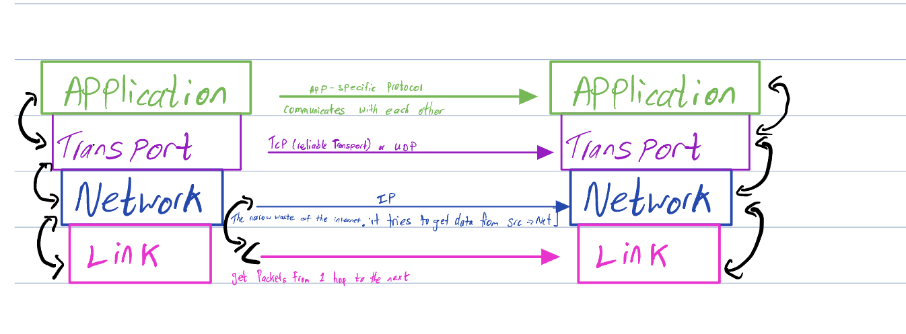

# Weeks 1-3

In weeks 1, 2, and 3 I was introduced to what a network is, any group of devices connected by links, the definition of the internet, and a network of networks. I learned the different layers of the internet: application, transport, network, and link. These layers have a connection or a bottom-up perspective or a top-down perspective.

<figure><figcaption></figcaption></figure>

From a top-down perspective, we viewed it as a web vs the internet reviewing HTTP vs HTTPS which is more secure than HTTP. but from a bottom-up perspective I was introduced to packets vs switches&#x20;

On a fast cross-continental link (≈ 100Gbps), propagation delay usually dominates end-to-end packet delay (Most messages are smaller than 100MB).

&#x20;

\-> True. The propagation delay would take minimal time. Best case scenario would be speed of light scenario

&#x20;

On the same cross-continental link (≈ 100Gbps), when transferring a 100GB file, propagation delay still dominates end-to-end file delivery.

&#x20;

\->False. It will take a minimal amount of time in propagation delay (.02 sec)Switches forward packets

Fundamental challenges:

* Addressing and naming
* Mapping names to addresses
* Routing–how to populate and maintain forwarding tables

Look at header, find entry in forwarding table

&#x20;

&#x20;

Notes:

* Packets can have the same destination and sent across different links
* Home routers have a forwarding table but it is very small/ compressed
* Routers do 2 things
*
  * Manage forwarding table
  * Execute routing an  algorithm
* Routers use forwarding tables to figure out its destinations called a data plane
* Control plane is computing forwarding tables based on routing activity and figuring out topology of the network

&#x20;

Data plane vs control plane

| Data                                                   | Control                                              |
| ------------------------------------------------------ | ---------------------------------------------------- |
|  of physical servers                                   | number of services that interact with the data plane |
| Time: often. Every time a packet arrives we forward it | Time: per network  per event. Less often             |

&#x20;

Packet switching

&#x20;

| Advantages                                                                              | Disadvantages                |
| --------------------------------------------------------------------------------------- | ---------------------------- |
| more efficient by finding their own data paths to the destination address               | Packet loss is unpredictable |
| 
Do not need a dedicated channel better for sharing(especially bursty traffic)
 |                              |
| Dynamic bandwidth                                                                       |                              |
| Cheaper, simpler                                                                        |                              |
| Failure recovery is easier - end hosts do not need to even know about it                |                              |

&#x20;

&#x20;

Circuit switching

| Advantages                                                     | Disadvantages |
| -------------------------------------------------------------- | ------------- |
| 
Better performance for applications more predictable
 |               |
| More understandable(economic model is more straight forward )  |               |
| Complicated                                                    |               |

&#x20;

Store packets in a queue

When packets overload they will eventually drop packets from the end of the queue

&#x20;

Switch has the option to give sources to slow down or ignore one of and it may talk to someone else.

Load balancing - switch choses the next best path

&#x20;

\= parking + speed over time +

Pkt delay = transmission delay + propagation delay  + queueing delay

&#x20;

## Working on&#x20;

I have been working on network exploration. I have got as far as the packet analysis where I was unable to run the sample.py file. I will continue to work on step 3: They've got mail! and step4: That web traffic though&#x20;

&#x20;

&#x20;

&#x20;
